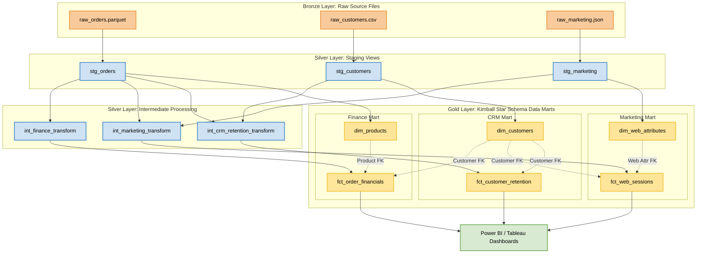

\# Data Platform Architecture \& Blueprint 🏗️

This document details the system design, data flow topology, and data modeling boundaries of the Amazon Marketplace Analytics Platform.

\---

\## 1. The Kimball Enterprise Bus Matrix

The Bus Matrix defines the shared blueprint across our enterprise data assets. It cross-references business processes (which become transactional \*\*Fact Tables\*\*) against conformed dimensions (reusable \*\*Dimension Tables\*\*). This layout guarantees an absolute single version of truth across independent business units.

| Business Process (Fact Tables) | Dim Customers 👥 | Dim Products 📦 | Dim Web Attributes 🌐 | Dim Date 📅 |

| :--- | :---: | :---: | :---: | :---: |

| \*\*Order Financials\*\* \*(Finance Mart)\* | \*\*X\*\* | \*\*X\*\* | | \*\*X\*\* |

| \*\*Web Sessions\*\* \*(Marketing Mart)\* | \*\*X\*\* | | \*\*X\*\* | \*\*X\*\* |

| \*\*Customer Retention\*\* \*(CRM Mart)\* | \*\*X\*\* | | | \*\*X\*\* |

\*Architectural Rule:\* `Dim Customers` and `Dim Date` are \*\*Conformed Dimensions\*\*. They share the exact same structural keys across all downstream Data Marts to prevent data discrepancy between departments.

\---

\## 2. Data Flow Diagram (DFD)

The platform follows a strict, non-skipping \*\*Medallion Architecture (Bronze → Silver → Gold)\*\*. Data moves sequentially through layers to transition from raw operational storage to highly optimized dimensional schemas.

\---

\## 3. Layer Processing Definitions

\### 🥈 Silver Staging Layer (Atomic Views)

\*   \*\*Materialization:\*\* `view`

\*   \*\*Rule:\*\* 1:1 structural copy of the raw source file. No multi-table combinations are allowed.

\*   \*\*Transformations:\*\* Enforces strong data type casting, converts text strings to standard ISO dates, handles missing strings using `COALESCE`, and normalizes column headers to lowercase underscores.

\### 🥈 Silver Intermediate Layer (Consolidated Logic)

\*   \*\*Materialization:\*\* `view`

\*   \*\*Rule:\*\* Aggregates and links raw identifiers. 

\*   \*\*Transformations:\*\* Resolves table boundaries using left joins across staging views to establish relational links before data mart delivery.

\### 🥇 Gold Presentation Layer (Target Data Marts)

\*   \*\*Materialization:\*\* `table`

\*   \*\*Rule:\*\* Structured explicitly using Kimball Star Schema design principles (Facts and Dimensions).

\*   \*\*Transformations:\*\* Computes business KPIs (Net profit margins, retention spans, conversion metrics) materialized physically to local storage blocks for peak BI reporting speed.

